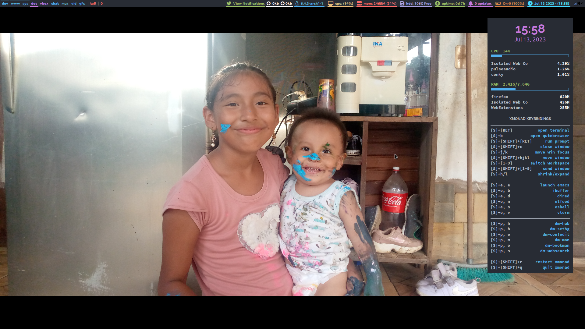
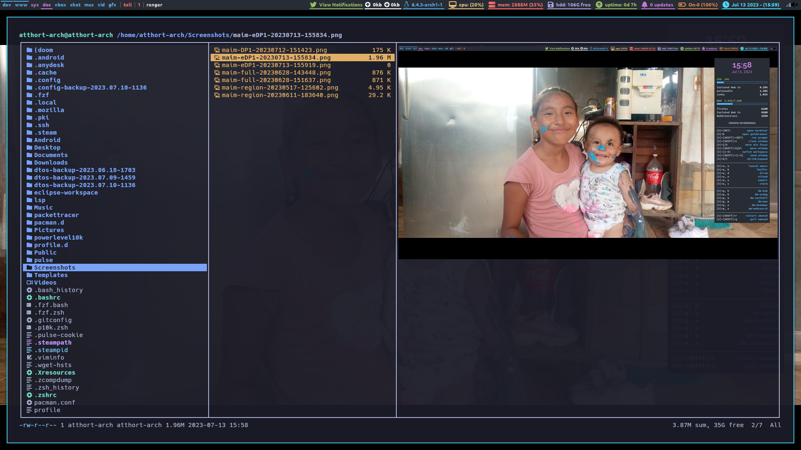

<em>Enviroment <a href="https://github.com/LimbergVillcaCoraite/DtosArchLinux" align="center">GitHub Repository</a> (GitHub)</em>

<h1 align="center">XMonad Starter Kit</h1>

    
     

<a href="https://github.com/NeshHari/XMonad/issues"><a>

<h2 align="center">Configuration</h2>

 -- Initial --

### About project
Windows Manager base haskell
---

### Hardware
- Computer: Asus k556U
- Processor: Intel Core i5-7200U
- Memory: 8GB
- HDD: 1TB

### Booteable usb
- Pen drive: Sandisk 4GB

<h2 align="center">Install ArchLinux</h2>

 -- Initial --

### Instructions to boot usb
1. Download rufus on another computer.
    Link: https://rufus.ie/es/
2. Connect Pen Drive.
3. Open rufus and select according to your preference.
4. Press start.
    Reference bootUsb: https://youtu.be/GvI0oyTsuxI

### Instructions to install ArchLinux
Link: https://wiki.archlinux.org/title/installation_guide

<h2 align="center">Programs</h2>

 -- Install --

### Dedendencies and packages
- Enviroment: xmonad, xmobar
- Menu: dmenu
- Package manager: pacman, paru
- Display manager: arandr
- Multimedia:
    * Video: mpv
    * Music: cmus
- Code editor:
    - Inteface: Visual Studio Code
    - Terminal: Neovim, nano, vim
- Mtp reader: simple-mtpfs
- Files: ranger
- Wallpaper: nitrogen
- Browser
    - Interface: firefox, google-chrome
    - Terminal: qutebrowser
- Smartphone manager: scrcpy
- Version manager: git

<h2 align="center">Use</h2>

 --Shortcuts --

### Basic shortcuts
xmonad

| Shortcut                                    | Action         |
|---------------------------------------------|----------------|
| mod + enter                                 |  Open terminal |
| mod + shift + enter                         |  Open Dmenu    |
| mod + enter + r                             | Restart xmonad |
| mod + shift + q                             | Power machine  |
| mod + n                                     |  Open neovim   |
| mod + shift + 1/9                           |  Send window   |
| mod + b                                     |Open qutebrowser|
| mod + r                                     |  Open ranger   |
| mod + v                                     | Open virtualbox|
| mod + 1/9                                   |  Switch window |
| mod + shift + l                             |  Lock screen   |
| mod + space                                 |  Full screen   |

kitty

| Shortcut                                    | Action         |
|---------------------------------------------|----------------|
| ctrl + shift + enter                        |Open terminal window|
| ctrl + shift + z                            |Terminal window full screen|

nvchad

---
### Screenshots
- Ranger + kitty

- Neovim + nvchad

- Terminal

- Multimonitor

---
### Reference
* https://archlinux.org/
* https://archives.haskell.org/projects.haskell.org/xmobar/#example-for-using-the-dbus-ipc-interface-with-xmonad
* https://github.com/NvChad/NvChad
